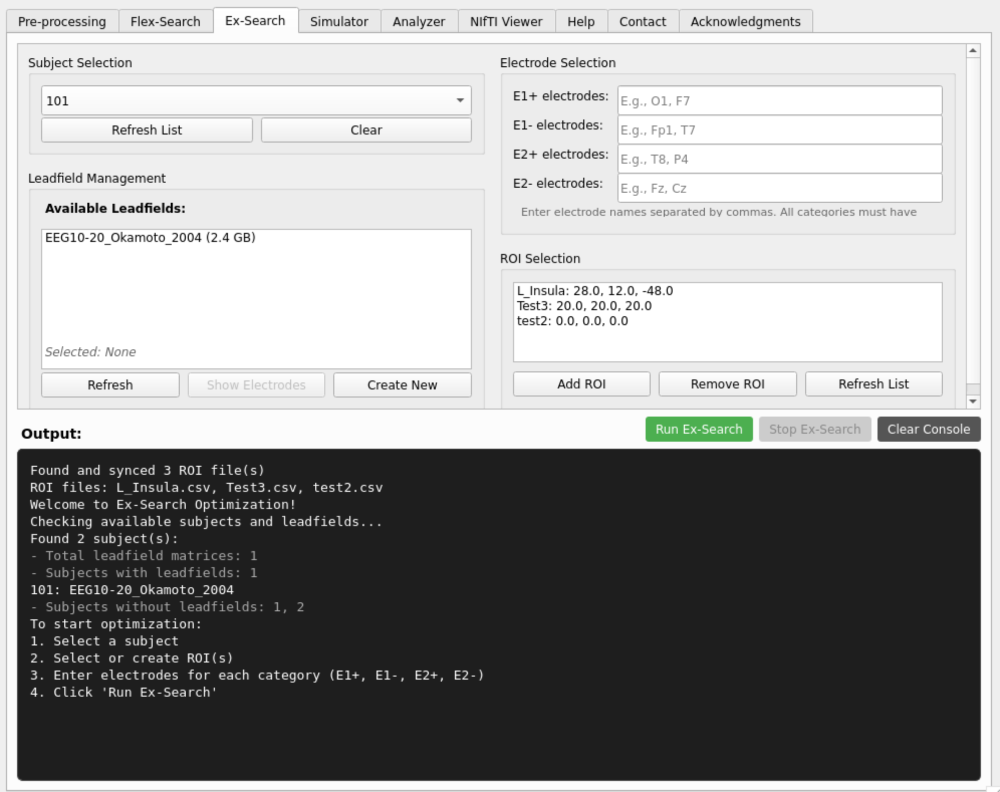
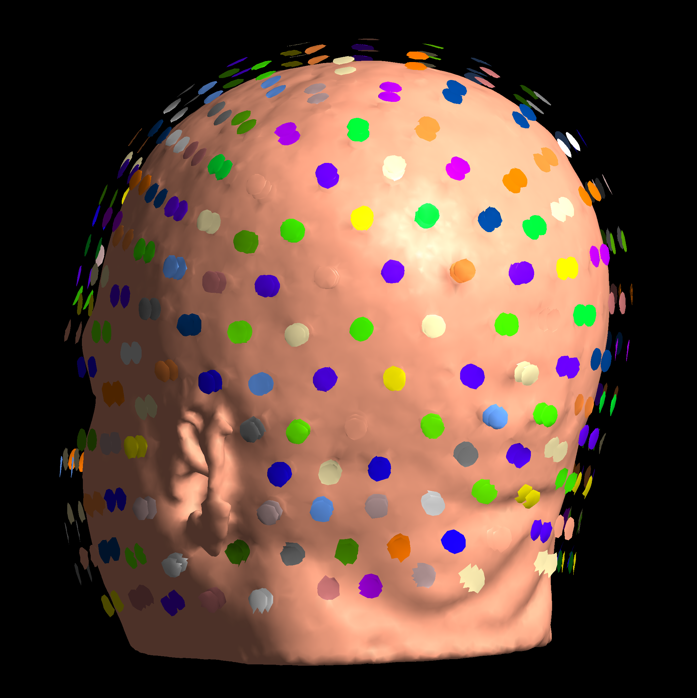
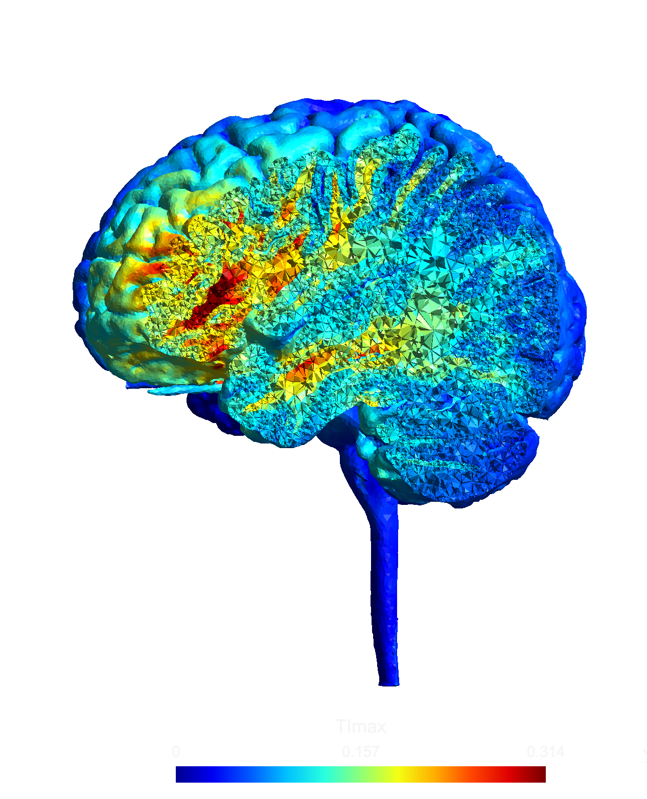
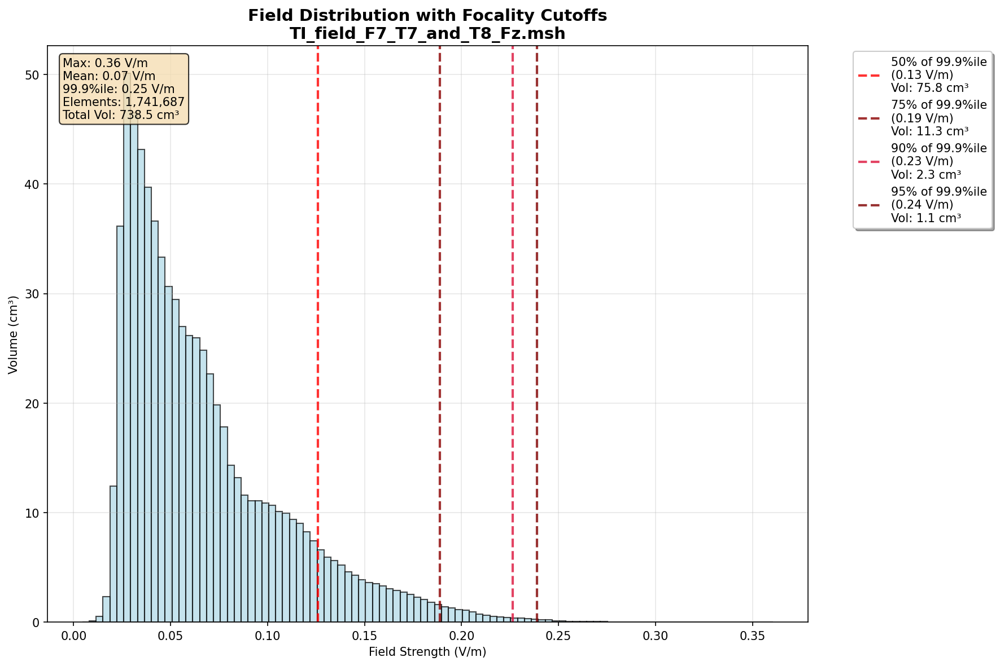

# Ex-Search TI Optimization Pipeline

The Ex-Search module provides an exaustive search approach for Temporal Interference (TI) simulations. The system features unified logging, multiple EEG net support, flexible leadfield management.

## Overview

Ex-Search utilizes leadfield-based optimization to determine optimal electrode configurations for TI stimulation based on:
- **Multiple EEG Nets**: Support for high-density GSN-HydroCel (185, 256), and regular EGI 10-20 nets
- **ROI Analysis**: fixed 3mm sphere sampling with both TImax and TImean calculations
- **Field Metrics**: Volume-weighted analysis with percentiles and focality measures
- **Unified Logging**: Professional pipeline tracking in single log file

## User Interface



The interface provides comprehensive controls for:
- **Subject Selection**: Choose from available subjects with automatic leadfield scanning
- **Leadfield Management**: View existing leadfields, create new ones, and show electrode configurations
- **ROI Configuration**: Add target regions with coordinates and manage multiple ROIs
- **Electrode Setup**: Configure E1+, E1-, E2+, E2- with support for both GSN and 10-20 formats
- **Execution Control**: Run optimization with real-time progress tracking

## Supported EEG Networks

Ex-Search automatically detects and supports multiple EEG electrode configurations:

### Standard 10-20 System

*EGI 10-20 Okamoto 2004 electrode configuration - widely used standard with 32 electrodes*

### High-Density GSN System  

*GSN-HydroCel 256 electrode configuration - high-density net for precise targeting*

## Example: TI Field Analysis Pipeline

We demonstrate the Ex-Search pipeline capabilities using a representative TI stimulation analysis targeting the left insula region with F7/T7 and T8/Fz electrode pairs.

### Analysis Setup
- **Subject**: 101
- **EEG Net**: EEG10-20_Okamoto_2004
- **Target ROI**: Left insula region
- **Electrode Configuration**: F7_T7 <> T8_Fz
- **Current**: 1mA (default)
- **Analysis**: Enhanced 3mm sphere ROI sampling

### Field Visualization

**Cortical Surface Distribution:**

*TI field distribution visualized on the cortical surface showing spatial targeting and field intensity*

### Statistical Analysis

**Volume-Weighted Field Distribution:**

*Volume-weighted field distribution histogram with focality thresholds and ROI indicators*

**Quantitative Results:**

| Electrode Configuration | TImax ROI | TImean ROI | Peak Field | 95th % | 99th % | 99.9th % | Focality 50% | Focality 75% | Focality 90% | Focality 95% | Peak Location |
|------------------------|-----------|------------|------------|--------|--------|----------|--------------|--------------|--------------|--------------|---------------|
| F7_T7 <> T8_Fz | 0.076 V/m | 0.062 V/m | 0.361 V/m | 0.154 V/m | 0.200 V/m | 0.246 V/m | 81.9 mm² | 13.4 mm² | 2.9 mm² | 1.6 mm² | (-45.12, 34.09, -40.45) |

## Key Features

### Enhanced ROI Analysis
- **3mm Sphere Sampling**: 20-point sampling around ROI coordinates for statistical analysis
- **Metrics**: Both TImax (peak) and TImean (average) values in target region

### Field Distribution Analysis
- **Volume-Weighted Statistics**: Percentile calculations (95%, 99%, 99.9%) accounting for tissue volume
- **Focality Metrics**: Threshold-based analysis (50%, 75%, 90%, 95% of 99.9 percentile)
- **Peak Localization**: XYZ coordinates of maximum field intensity

### Professional Output
- **Unified Logging**: Complete pipeline execution tracking in single timestamped log file
- **Comprehensive CSV**: All metrics combined in final_output.csv for easy analysis
- **Visualization**: Field distribution histograms with ROI indicators and focality cutoffs

## Pipeline Workflow

### 1. EEG Net Selection
```
[INFO] Scanning available EEG nets for subject 101...
  1. EGI10-10_Cutini_2011.csv
  2. EGI10-10_UI_Jurak_2007.csv  
  3. EGI10-20_Okamoto_2004.csv
  4. GSN-HydroCel-185.csv        # Default selection
  5. GSN-HydroCel-256.csv
  6. easycap_BC_TMS64_X21.csv
```

### 2. Leadfield Management
- **Intelligent Detection**: Automatic scanning of existing leadfields
- **Flexible Creation**: Generate leadfields for any supported EEG net
- **Performance Optimization**: Efficient loading of large matrices (2-20GB)

### 3. Analysis Pipeline
- **ROI Sampling**: Enhanced sphere-based analysis around target coordinates
- **Field Analysis**: Volume-weighted statistical calculations
- **Visualization**: Automatic histogram generation with professional formatting

## Performance Characteristics

### Processing Times

| EEG Network | Leadfield Size | Loading Time | Simulation Time |
|-------------|----------------|--------------|-----------------|
| GSN-HydroCel-185 | ~16GB | 2-3 minutes | 3-5 seconds |
| GSN-HydroCel-256 | ~25GB | 4-6 minutes | 5-8 seconds |
| EGI10-20 | ~2TGB | 30-60 seconds | 2-3 seconds |

## File Structure

### Input Organization
```
derivatives/SimNIBS/sub-{subject}/
├── m2m_{subject}/
│   ├── eeg_positions/           # EEG net configurations
│   │   ├── GSN-HydroCel-185.csv
│   │   ├── GSN-HydroCel-256.csv
│   │   └── EGI10-20_Okamoto_2004.csv
│   └── ROIs/                    # Target regions
│       ├── roi_list.txt
│       └── L_Insula.csv
├── leadfield_vol_GSN-HydroCel-185/   # Leadfield matrices
│   └── leadfield.hdf5
└── leadfield_vol_EGI10-20_Okamoto_2004/
    └── leadfield.hdf5
```

### Output Structure
```
derivatives/SimNIBS/sub-{subject}/ex-search/
├── L_Insula_GSN-HydroCel-185/      # ROI-specific results
│   ├── analysis/
│   │   ├── final_output.csv        # Complete results
│   │   ├── summary.csv            # Field analysis metrics
│   │   ├── *_histogram.png        # Visualizations
│   │   └── mesh_data.json         # Raw analysis data
│   └── TI_field_*.msh             # Simulation meshes
└── derivatives/logs/sub-{subject}/
    └── ex_search_20250122_143012.log  # Unified pipeline log
```

---

*Last Updated: June 2025*  
*Version: 2.0.4 (Unified Logging + Enhanced EEG Net Support)*  
